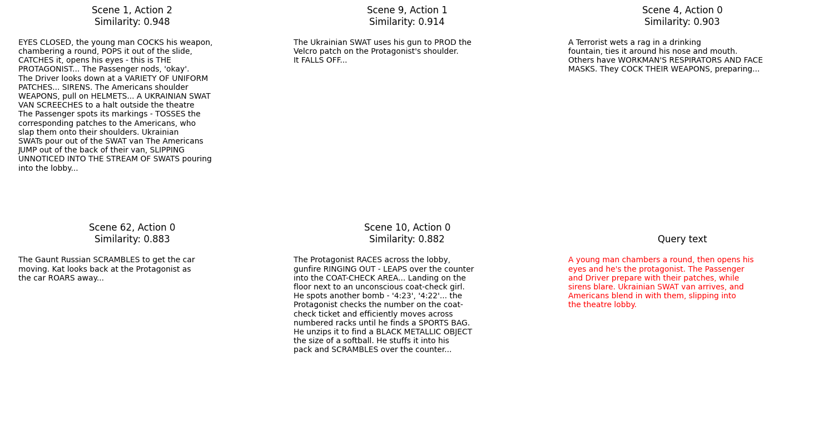

# Contextual Search Tool

This project implements a contextual search tool that leverages a pre-trained DistilBERT model for embedding and searching within movie scripts based on action and dialogue. The system is capable of fine-tuning the BERT model to improve search performance based on specific scenes and actions within a movie.

## Project Structure

```
.
├── scripts/
│   ├── __init__.py
│   ├── scene_extractor.py
│   ├── embedding_model.py
│   ├── search_tool.py
│   └── utils.py
│ 
├── Finetuned-DistilBert/
│   ├── config.json
│   ├── special_tokens_map.json
│   ├── tokenizer_config.json
│   ├── vocab.txt
│   └── model.safetensors
│ 
├── README.md
├── requirements.txt
└── examples/
    ├── Tenet.txt
    ├── Tenet_embeddings.pkl
    ├── Testing_scripts.ipynb
    ├── Contextual_Search_Tool.ipynb
    └── Scene_contextual_search.png
```

### `scene_extractor.py`
This script contains a `SceneExtractor` class that extracts scenes from a movie script and separates them into descriptions and dialogues. This enables better processing and embedding of the components of a scene.

### `embedding_model.py`
This script provides an `EmbeddingModel` class that uses a pre-trained DistilBERT model to generate sentence embeddings for the scenes and dialogues. The class also allows for fine-tuning the model based on a custom dataset to improve search results.

### `search_tool.py`
This script includes a `SearchTool` class that performs contextual searches within the embedded scenes and dialogues using cosine similarity. You can search for specific actions or dialogues and retrieve the most similar scenes in the movie script.

### `utils.py`
A utility script that contains helper functions for saving and loading models, and preparing data loaders for fine-tuning the model.

## Example Use Case

Below is an example of how the contextual search tool works. The query text provided is used to search for similar scenes and actions within the movie script, with similarity scores provided for each match.



In the image, the query text is:  
*"A young man chambers a round, then opens his eyes and he's the protagonist. The Passenger and Driver prepare with their patches, while sirens blare. Ukrainian SWAT van arrives, and Americans blend in with them, slipping into the theatre lobby."*

The tool searches through the script, embedding the query text and comparing it with the embedded scenes. The top results are displayed with their corresponding similarity scores.

## Installation

To install the necessary dependencies for this project, simply run:

```bash
pip install -r requirements.txt
```

## Usage

Here’s a brief example of how to use the provided classes:

```python
from scripts.scene_extractor import SceneExtractor
from scripts.embedding_model import EmbeddingModel
from scripts.search_tool import SearchTool

# Load and process the script by breaking it down into separate scenes
scenes = SceneExtractor('examples/Tenet.txt')

scene_extractor = SceneExtractor(script_lines)
scenes = scene_extractor.extract_scenes_from_script()

# Initialize the embedding model and fine-tune if necessary
embedding_model = EmbeddingModel()
search_tool = SearchTool(embedding_model)

# Embed action and dialogue of scenes
search_tool.embed_actions_and_dialogues(scenes)

# Search for similar action and dialogue based off query text
action_results = search_tool.search_actions("The Protagonist cleans himself and steps towards a car.", scenes, embedding_type='mean')
dialogoue_results = search_tool.search_dialogue("I have two minutes. Make up your mind.", scenes, embedding_type='mean')

# Print (df) top 5 most similar results to query text
action_results
dialogoue_results

# Save embeddings, transformer model name and movie script location
search_tool.save_embeddings('examples/Tenet_embeddings.pkl')

#Load saved embedding and setup tokenizer model
from scripts.search_tool import SearchTool
new_search_tool = SearchTool(embedding_model=None)
new_search_tool.load_embeddings('examples/Tenet_embeddings.pkl')

```

## License

This project is licensed under the MIT License - see the [LICENSE](LICENSE) file for details.
